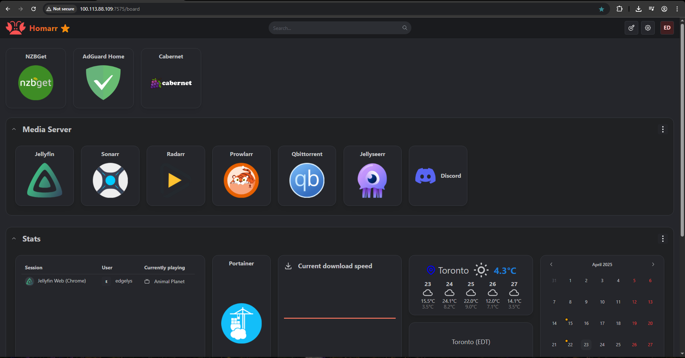
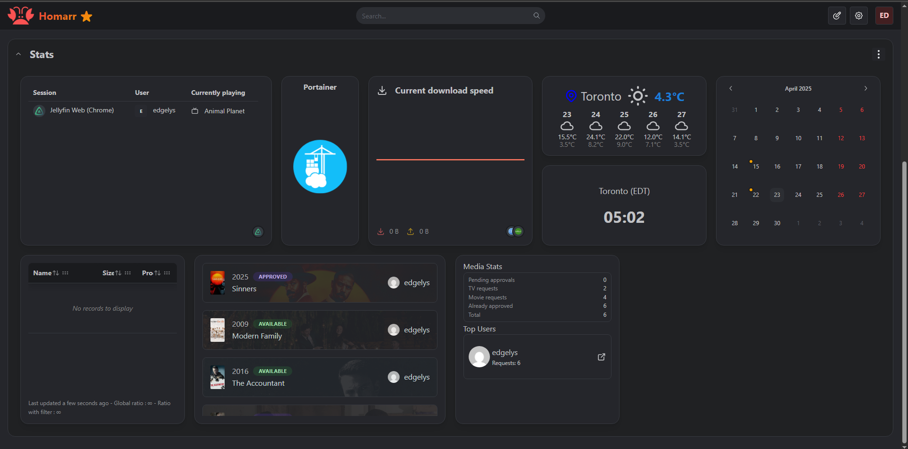
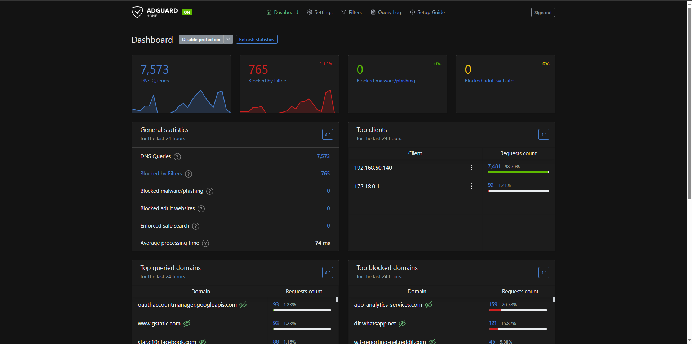
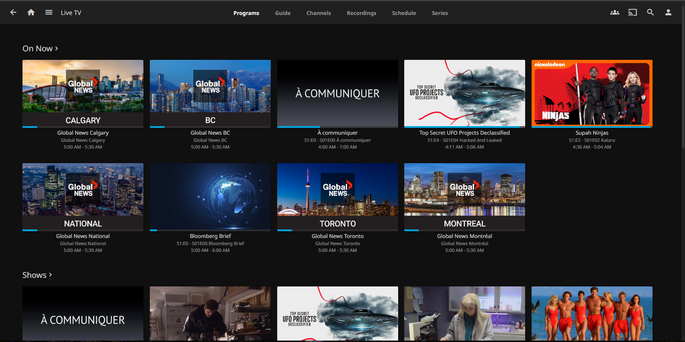
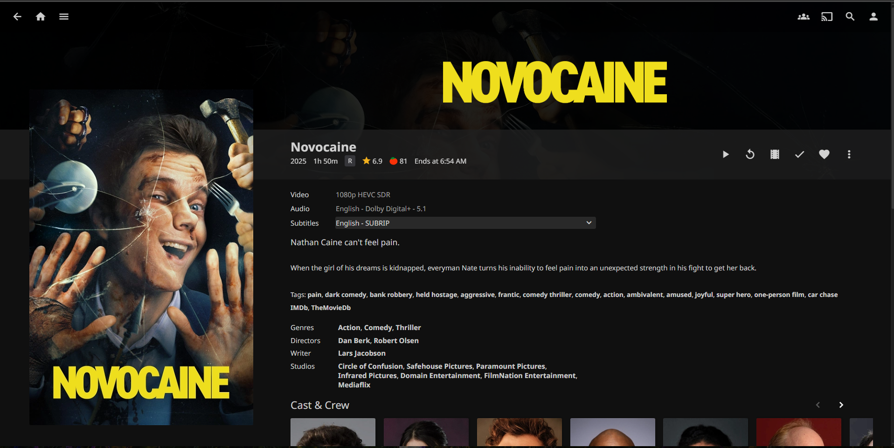
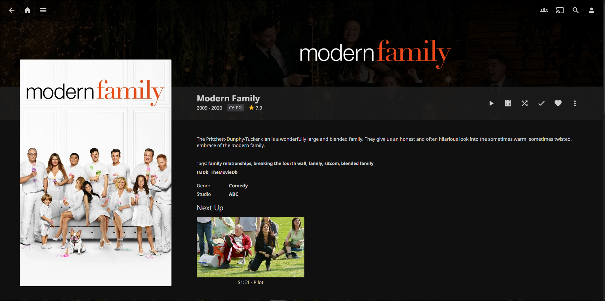
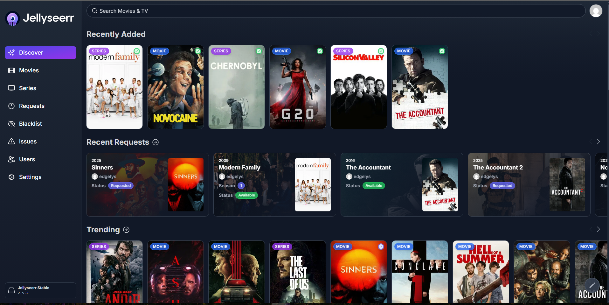

# 🧠 Self-Hosted Media Infrastructure (Docker Stack)

A fully automated, modular home media server deployed on Ubuntu 24.04 using Docker Compose, Ansible, and GitHub Actions.  
Features include torrent and Usenet automation, photo backup with Immich, IPTV streaming with EPG, secure remote access via Tailscale, containerized orchestration with best DevOps practices, and full monitoring with Prometheus/Grafana.

---

## 📃 Infrastructure as Code & Deployment Automation

This project is fully automated using **Ansible** and **GitHub Actions**:

- **Ansible Playbooks**: Manage the server setup, Docker Compose deployments, and configuration updates.
- **GitHub Actions Workflows**: Automatically trigger Ansible playbooks to redeploy the stack securely over **Tailscale VPN** when changes are pushed.

### 🔹 How It Works

1. **Ansible Folder Structure**: All provisioning and deployment logic is stored under `/ansible`.
2. **Edit or Add New Services**: Modify or add a new service under `ansible/playbooks/` or `ansible/roles/`.
3. **Git Push**: When you push to the `main` branch, GitHub Actions triggers an SSH session over Tailscale to the server.
4. **Auto-Deployment**: The updated Ansible playbook automatically runs and applies changes to the live Docker Compose stack.

> **No manual SSH or docker commands needed. Full GitOps-style automation.**

---

## 📦 Stack Overview

| Service           | Purpose                                           |
|-------------------|---------------------------------------------------|
| **Jellyfin**       | Media playback & streaming platform              |
| **Sonarr**         | TV series automation (torrent & Usenet)           |
| **Radarr**         | Movie automation (torrent & Usenet)               |
| **qBittorrent**    | Torrent client with automation integration       |
| **NZBGet**         | Usenet downloader for high-speed automation      |
| **Prowlarr**       | Indexer manager for Sonarr/Radarr                |
| **Jellyseerr**     | User request interface for Jellyfin              |
| **Cabernet**       | IPTV integration proxy with XMLTV EPG support    |
| **AdGuard Home**   | DNS-level ad blocker (network-wide filtering)    |
| **Homarr**         | Elegant dashboard UI to manage all services      |
| **Portainer**      | Docker container manager with GUI                |
| **FlareSolverr**   | Cloudflare bypass support for indexers           |
| **Prometheus**     | Metrics collection and alerting                 |
| **Grafana**        | Visualization of system and service metrics     |
| **Node Exporter**  | Host system metrics (CPU, RAM, Disk usage)       |
| **cAdvisor**       | Container-level resource monitoring             |
| **Immich**         | Self-hosted photo and video backup solution      |

---

## 🔐 Access & Networking

- **Tailscale Mesh VPN**: Secures remote access without port forwarding.
- **Services exposed**:
  - Jellyfin: `8096`
  - Sonarr: `8989`
  - Radarr: `7878`
  - qBittorrent: `8080`
  - NZBGet: `6789`
  - Prowlarr: `9696`
  - Jellyseerr: `5055`
  - AdGuard Home: `3000`
  - Homarr: `7575`
  - Cabernet: `6077`
  - Portainer: `9000`
  - Prometheus: `9090`
  - Grafana: `3001`
  - Immich: `2283`

---

## 🔁 Automation Flow

```
Jellyseerr
   │
   ├──► Radarr / Sonarr ───► qBittorrent / NZBGet
   │                             │
   └─────────────────────────────┘
        Hardlink import to Jellyfin
            │
        Stream with full metadata

Immich
   │
   └──► Auto backup photos/videos to SSD storage
```

- Requests are made via **Jellyseerr**.
- **Sonarr/Radarr** fetch via torrent or Usenet (qBittorrent/NZBGet).
- Completed downloads are **hardlinked** into `/data/media`.
- Jellyfin automatically picks up and displays new media.
- **Immich** automatically backs up and organizes all photos and videos securely.
- **Prometheus + Grafana** monitor server health and service metrics in real-time.

---

## ⚙️ Deployment Highlights

- Fully containerized using **Docker Compose**.
- Secure, portless access via **Tailscale VPN**.
- Full monitoring and alerting with **Prometheus**, **Grafana**, **Node Exporter**, and **cAdvisor**.
- Configurations version-controlled via **GitHub**.
- Automated server provisioning and environment setup with **Ansible**.
- Private **GitHub Actions workflows** auto-deploy latest configurations onto homelab server.
- Optimized transcoding with **VAAPI** hardware acceleration.
- Storage optimization separating HDD/SSD workloads.
- Personal cloud photo storage with **Immich**.

---

## 📁 Directory Layout

```
/data/
├── configs/
│   ├── jellyfin/
│   ├── radarr/
│   ├── sonarr/
│   ├── prowarr/
│   ├── qbittorrent/
│   ├── immich/
│   └── other service configs...
├── media/
│   ├── movies/
│   ├── tv/
│   └── photos/   # Immich storage
├── torrents/
│   ├── movies/
│   └── tv/
├── nzbs/
│   ├── movies/
│   └── tv/
├── backups/
│   ├── media_backups/
│   └── config_backups/
```

---

## 🚀 Automation & Monitoring

| Feature                        | Tools Used                           |
|:--------------------------------|:-------------------------------------|
| Infrastructure-as-Code         | Ansible, Docker Compose              |
| Remote deploy via CI/CD         | GitHub Actions, Tailscale SSH         |
| System and container monitoring | Prometheus, Grafana, Node Exporter, cAdvisor |
| Storage optimization            | SSD for downloads/transcodes, HDD for long-term storage |
| Media acquisition automation    | Jellyseerr, Sonarr, Radarr, Prowlarr |
| IPTV with full EPG              | Cabernet + EPGShare XMLTV sources     |
| VPN Mesh                        | Tailscale                            |
| Personal Photo Cloud            | Immich                               |

---

## 🧐 Skills Demonstrated

- Docker Compose orchestration, volume and network management
- Infrastructure automation with Ansible playbooks
- CI/CD pipeline creation with GitHub Actions and Tailscale
- Full-stack observability design with Prometheus and Grafana
- Media pipeline optimization using hardlinking and SSD/HDD separation
- Advanced remote access security with Tailscale Mesh VPN
- Self-hosted IPTV integration with custom XMLTV EPG feeds
- Personal cloud photo management with Immich
- Systemd integration and runtime service optimization

---

## 📸 Screenshots

> _Example Screenshots:_










---

## 🧾 License

MIT License — feel free to fork, modify, and enhance your own self-hosted infrastructure.
