# 🖥️ Nayeem's Homelab

Welcome to my homelab documentation! This setup serves as both a practical IT/DevOps playground and a research-oriented environment. It highlights my hands-on experience with virtualization, containerization, network mesh VPNs, monitoring, and automation—skills that are immediately transferable to industry roles or academic projects.

---

## **Homelab Architecture Diagram**

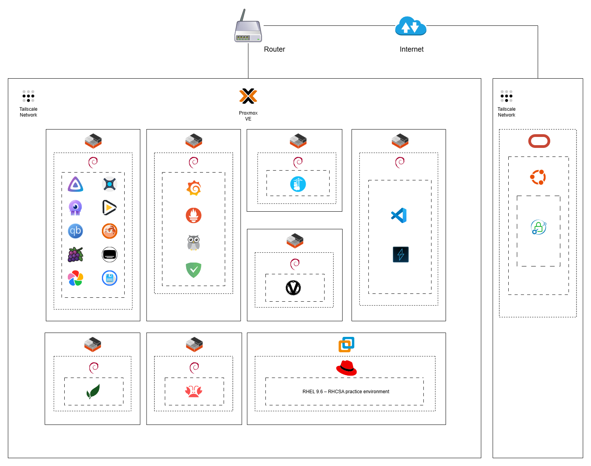

---
## **Proxmox Virtualization Overview**

| VMID | Name           | Type | Purpose / Key Services |
|------|---------------|------|-----------------------|
| 100  | media-server   | LXC  | Primary Docker stack: Media servers (Jellyfin, Sonarr, Radarr), Automation (Bazarr, Prowlarr), Monitoring (Prometheus, Grafana, cAdvisor), Networking (AdGuard), Immich server (photo backup + ML) |
| 102  | portainer      | LXC  | Portainer UI for Docker management across all nodes |
| 103  | vaultwarden    | LXC  | Vaultwarden (password manager) with Portainer Agent for orchestration |
| 104  | dashboard      | LXC  | Homarr dashboard, Glance status board, Portainer Agent |
| 105  | coder          | LXC  | Code-Server (VSCode in browser), Linkwarden stack (Postgres + Meilisearch), Portainer Agent |
| 106  | paperless      | LXC  | Paperless-NGX document management (Postgres, Redis, Gotenberg, Tika), Portainer Agent |
| 101  | RHCSA VM       | VM   | RHEL 9.6 – RHCSA practice environment with snapshot management |

**Notes:**
- All LXC containers and VM101 run **Tailscale**, providing a secure mesh VPN.
- Portainer Agent is deployed on all LXC nodes for centralized Docker orchestration and monitoring.
- A free **Oracle VPS** is integrated into the Tailscale mesh for reverse proxy experimentation using **Caddy**.

---

## **Docker Service Overview**

### **Media-Server (LXC 100)**

| Service | Image | Ports | Notes |
|---------|-------|-------|-------|
| Portainer Agent | `portainer/agent:2.33.1` | 9001/tcp | Manages Docker nodes |
| Cabernet | `ghcr.io/cabernetwork/cabernet:latest` | 5004/tcp, 6077/tcp | Streaming & caching service |
| qBittorrent | `lscr.io/linuxserver/qbittorrent` | 8080/tcp, 6881/tcp & udp | Torrent client |
| Prowlarr | `lscr.io/linuxserver/prowlarr` | 9696/tcp | Indexer manager |
| Sonarr | `lscr.io/linuxserver/sonarr` | 8989/tcp | TV automation |
| Filebrowser | `hurlenko/filebrowser` | 8081->8080/tcp | Web-based file manager |
| Bazarr | `lscr.io/linuxserver/bazarr` | 6767/tcp | Subtitles manager |
| Prometheus | `prom/prometheus:latest` | 9090/tcp | Monitoring and metrics |
| Grafana | `grafana/grafana-oss:latest` | 3001->3000/tcp | Visualization and dashboards |
| Radarr | `lscr.io/linuxserver/radarr` | 7878/tcp | Movie automation |
| Node Exporter | `prom/node-exporter:latest` | 9100/tcp | Node-level metrics |
| Jellyfin | `jellyfin/jellyfin:latest` | 8096/tcp | Media server |
| AdGuard Home | `adguard/adguardhome` | 53/udp/tcp, 80/443/tcp, 67/udp, 853/tcp/udp, 3000/5443 | Network-wide ad-blocking and DNS |
| NZBGet | `linuxserver/nzbget` | 6789/tcp | Usenet downloader |
| cAdvisor | `gcr.io/cadvisor/cadvisor:latest` | 8082->8080/tcp | Container metrics |
| Flaresolverr | `ghcr.io/flaresolverr/flaresolverr:latest` | - | Web scraper |
| Jellyseerr | `fallenbagel/jellyseerr:latest` | 5055/tcp | Media request manager |
| Immich Server & ML | `ghcr.io/immich-app` | 2283/tcp | Photo backup & ML processing |
| Immich Postgres | `tensorchord/pgvecto-rs:pg14-v0.2.0` | 5432/tcp | Database |
| Immich Redis | `valkey/valkey:8-bookworm` | 6379/tcp | Cache |

---

### **Portainer Node (LXC 102)**
| Service | Image | Notes |
|---------|-------|------|
| Portainer | `portainer/portainer-ce:latest` | Main Docker UI managing all nodes via Portainer Agents |

---

### **Vaultwarden Node (LXC 103)**
| Service | Image | Ports | Notes |
|---------|-------|-------|-------|
| Vaultwarden | `vaultwarden/server:latest` | 8080/tcp | Self-hosted password manager |
| Portainer Agent | `portainer/agent:2.33.1` | 9001/tcp | Node orchestration |

---

### **Dashboard Node (LXC 104)**
| Service | Image | Ports | Notes |
|---------|-------|-------|-------|
| Homarr | `ghcr.io/homarr-labs/homarr:latest` | 7575/tcp | Central dashboard for the homelab |
| Glance | `glanceapp/glance` | 8080/tcp | Status board and monitoring overview |
| Portainer Agent | `portainer/agent:latest` | 9001/tcp | Node orchestration |

---

### **Coder Node (LXC 105)**
| Service | Image | Ports | Notes |
|---------|-------|-------|-------|
| Code-Server | `lscr.io/linuxserver/code-server:latest` | 8443/tcp | Web-based IDE (VSCode) |
| Linkwarden | `ghcr.io/linkwarden/linkwarden:latest` | 3000/tcp | Self-hosted password manager |
| Postgres | `postgres:16-alpine` | 5432/tcp | Linkwarden DB |
| Meilisearch | `getmeili/meilisearch:v1.12.8` | 7700/tcp | Linkwarden search engine |
| Portainer Agent | `portainer/agent:latest` | 9001/tcp | Node orchestration |

---

### **Paperless Node (LXC 106)**
| Service | Image | Ports | Notes |
|---------|-------|-------|-------|
| Paperless-NGX | `ghcr.io/paperless-ngx/paperless-ngx:latest` | 8000/tcp | Document management system |
| Redis | `redis:8` | 6379/tcp | Broker for Paperless |
| Gotenberg | `gotenberg/gotenberg:8.22` | 3000/tcp | PDF processing service |
| Tika | `apache/tika:latest` | 9998/tcp | OCR / text extraction |
| Postgres | `postgres:17` | 5432/tcp | Database for Paperless |
| Portainer Agent | `portainer/agent:latest` | 9001/tcp | Node orchestration |

---

## **Networking & Connectivity**
- All nodes connected via **Tailscale mesh VPN** for secure internal networking.
- **Oracle VPS** integrated in Tailscale mesh for **reverse proxy testing** using **Caddy**.
- Exposed services are mapped to host ports for selective external access.
- Demonstrates expertise in:
  - Container orchestration and monitoring
  - VPN mesh networking
  - Self-hosted service deployment
  - Infrastructure automation and observability

---
## **Screenshots**

### Proxmox
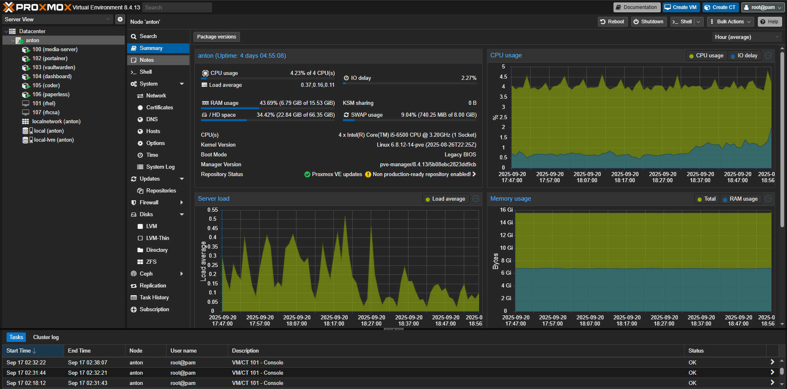

### Portainer
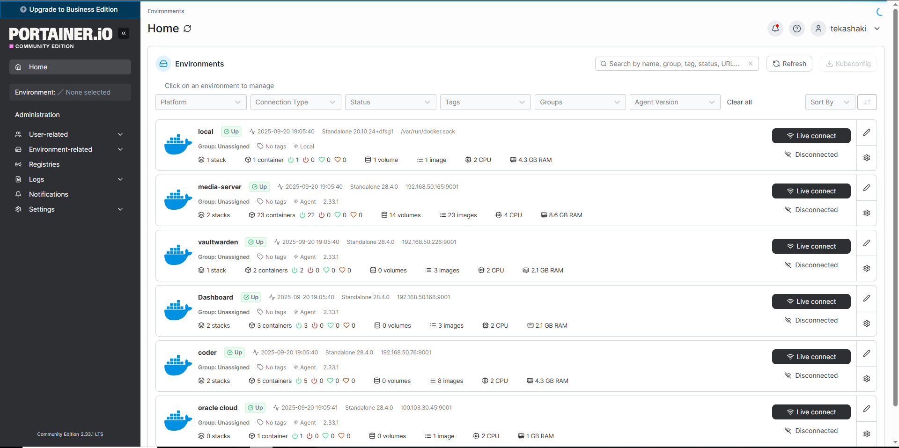

### AdGuard Home
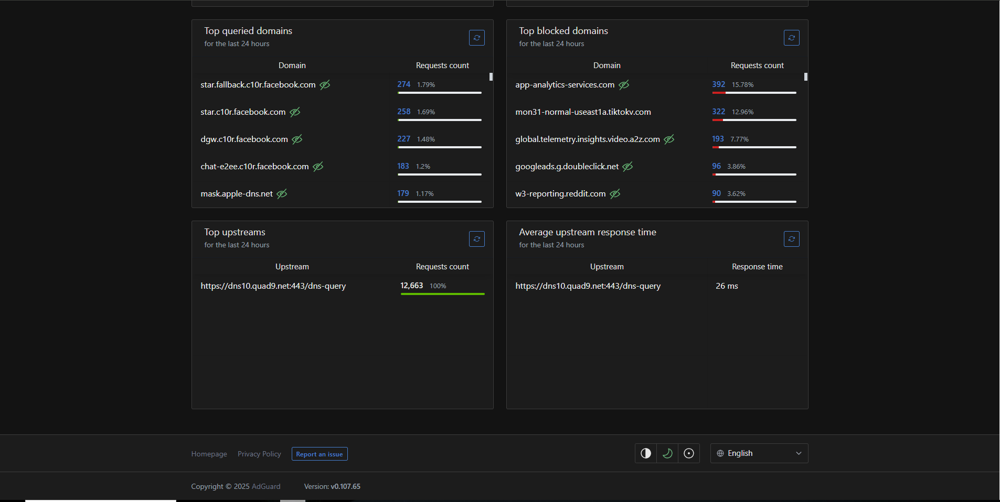

### Code-Server
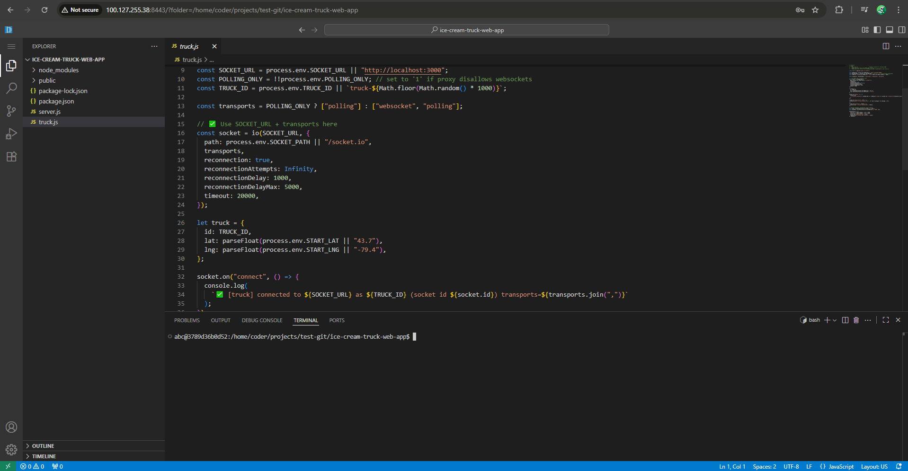

### Filebrowser
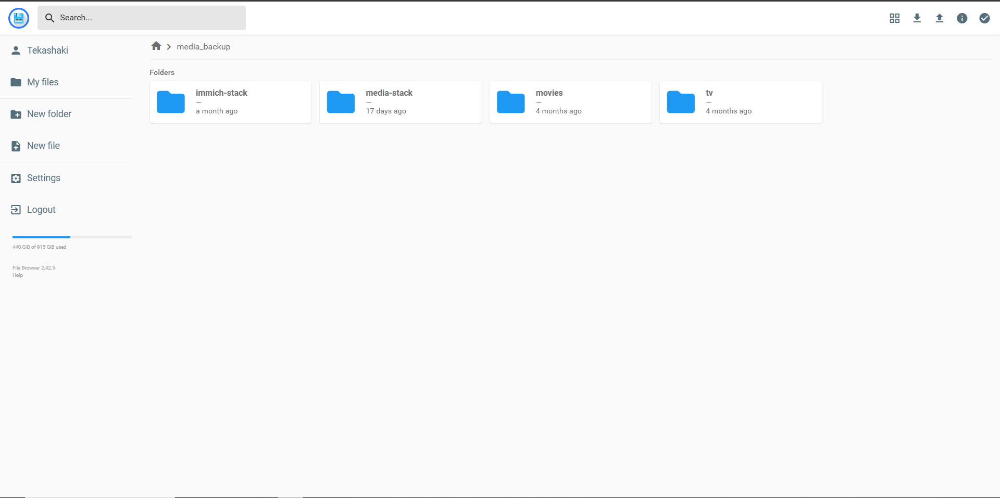

### Grafana
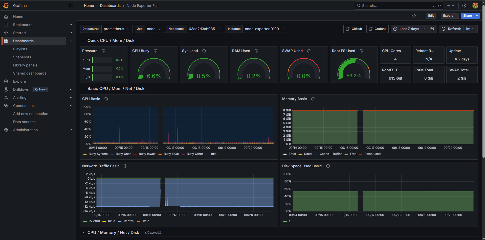

### Homarr Dashboard
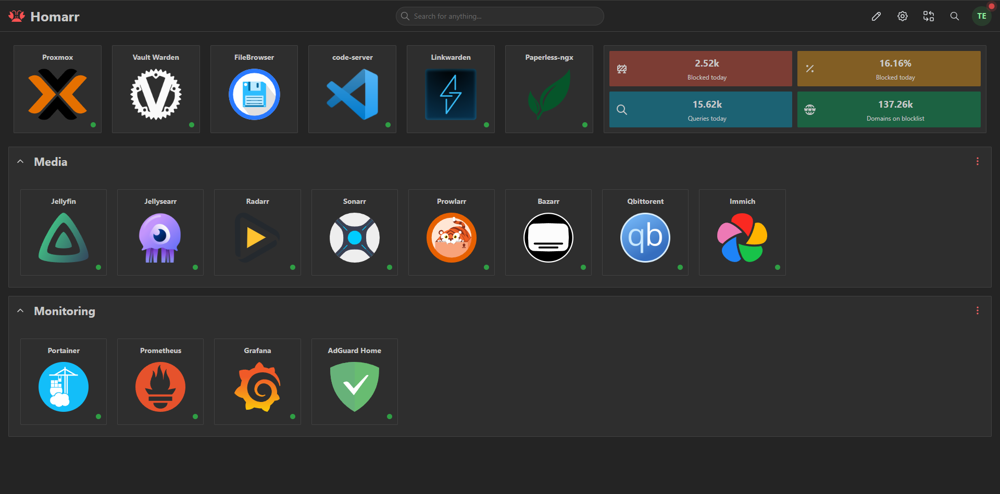

### Immich
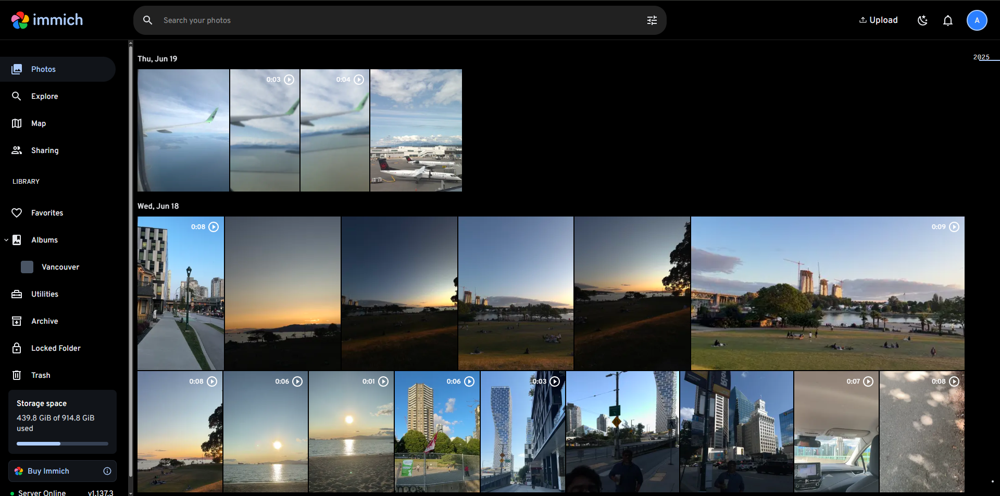

### Jellyfin

### Linkwarden
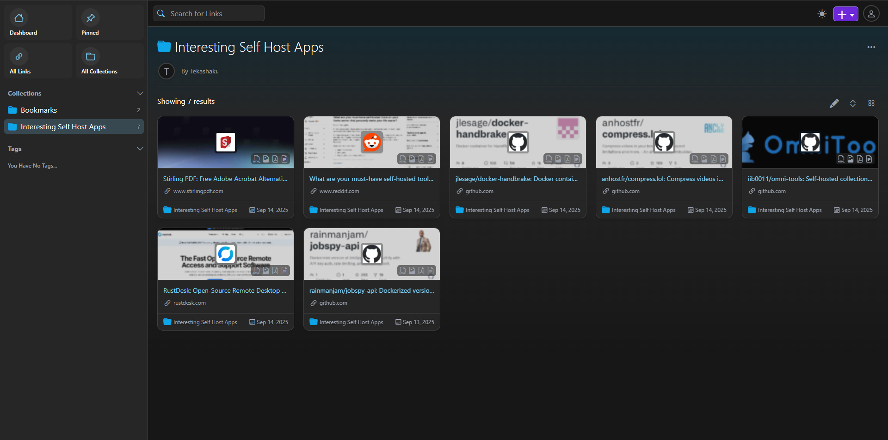

### Paperless-NGX
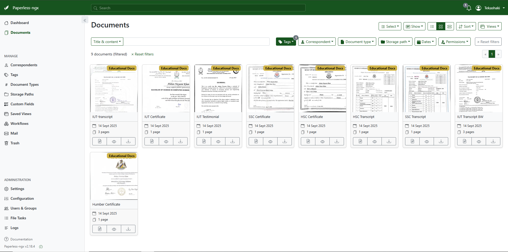

*📌 Note:* All services are actively maintained, monitored, and secured, with emphasis on reproducibility, scaling, and experimentation.

